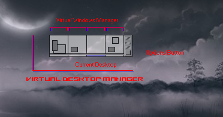
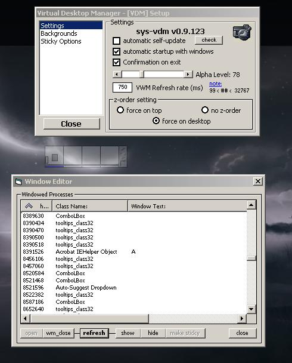

# System - Virtual Desktop Manager

Xeno Innovations' - Virtual Desktop Manager allows you to run 4 different desktops without filling up the taskbar and minimized GDI usage. (virtual window manager vdm vwm)



## Introduction

This is a Linux-like **multiple desktop engine** (virtual desktop manager) for your Microsoft Windows OS that allows the user to take a hold of the desktop environment. Many of the other programmers who made a Virtual Window Manager (VWM) simply moved your windows off screen to create this effect had trouble losing windows or could not move all windows in a program. Litestep and SharpE fell into this problem but would fix it through extra coding. However the method used here; hiding windows has a greater advantage of freeing up your taskbar items, memory usage as well as not losing the position of your workspace.

Like any multi-desktop environment, there are some programs that do not work well with either being moved to another location far off the screen (usually in a negative (x, y) position) or with being forced to hide (really rare). This is an issue that is fixed by allowing you to force specified windows to stay "sticky" - a method that allows windows to not hide on switch of desktop workspace.



## Features

* Automatic self-update
* Windows 2000/XP Alpha Transparency
* Changeable VWM refresh rate (VWM - Virtual Window Manager)
* Memorize Start-Up Position
* Startup with Windows OS
* Lock Toolbar Window
* Gather All Desktops
* VDM Window Z-Order position
  * VDM-Toolbar OnTop
  * VDM-Toolbar Apart of Desktop
  * VDM-Toolbar No Z-Order
* Custom Backgrounds on each desktop
  * Stretch, Center or Tiled
  * Custom Background Color per Desktop
* EZ Sticky Window Editor
* Presets:
  * WINAMP
  * Shell_TrayWnd (Windows Taskbar)
  * "Windows Task Manager"

## Scripting Behind Sticky Windows & Wallpaper

The program contains a scripting file (sys-vdm.dat) which may be modified by hand if needed, but is not recommended. This file is very self-explanatory.

Under the **`[sticky]...[/sticky]`** section the parameter, line delimited. Both parameters may be used together on the same line:

* **`[cls]...[/cls]`** - Holds the Class Name of the sticky window
* **`[txt]...[/txt]`** - Holds the Window Title of the sticky window

Under Wall Paper, there are three parameters per line.

1. Desktop Window Index Number
2. Wallpaper Style
3. Path to Wallpaper

```txt
[sticky]
  [cls]Shell_TrayWnd[/cls]
  [cls]Winamp v1.x[/cls]
  [cls]Winamp PE[/cls]
  [cls]Winamp EQ[/cls]
  [cls]Winamp Gen[/cls]
  [txt]Windows Task Manager[/txt]
  [txt]Virtual Desktop Manager - [VDM] Setup[/txt]
[end]

; ndx | style | path
;   xCenter  = 0
;   xTile    = 1
;   xStretch = 2
[wallpaper]
  1|2|G:\prog\sys-vdm\_skin\a gift of moonlight - blue.jpg
  2|2|G:\prog\sys-vdm\_skin\dereliction_1280x1024.jpg
  3|0|G:\prog\sys-vdm\_skin\heacarol7.jpg
  4|1|G:\prog\sys-vdm\_skin\AtlantesPulse.jpg
[end]
```

## Dependencies

These critical files are for the Program & Self-Updating system (not included).

* MSVBM60.DLL
* MSWINSCK.OCX (sp6)
* MSCOMCTRL.OCX (sp6)

[Download](http://www.microsoft.com/downloads/details.aspx?familyid=7b9ba261-7a9c-43e7-9117-f673077ffb3c&displaylang=en) - VB6 Run-Time Redistro Service Pack 6

## History

This project was origionally hosted at [CodeProject.com](https://www.codeproject.com/Articles/20500/System-Virtual-Desktop-Manager), back before GitHub, and the only other options were SourceForge.com and PlanetSourceCode.com. CodeProject was more crisp and clean for sharing projects and ideas.

* 0.9.122: [2006-12-26]
  * Various Upgrades.. (can't remember right now)
* 0.9.113
  * Applied background image switch with background color change, which is useful on Windows' * systems earlier than 2000/XP
* 0.9.100: [2005]
  * Losing windows during rapid switching fixed by disabling sys-vdm momentarily until switch of * desktops is completely finished
* 0.9.94: [2005-02-15]
  * Losing windows fixed through careless index number
  * 'Sticky Windows' upgraded.
* 0.5.51: [2004-11-30]
  * Initial release

Damian J. Suess of Xeno Innovations, Inc. [2000-2007]
